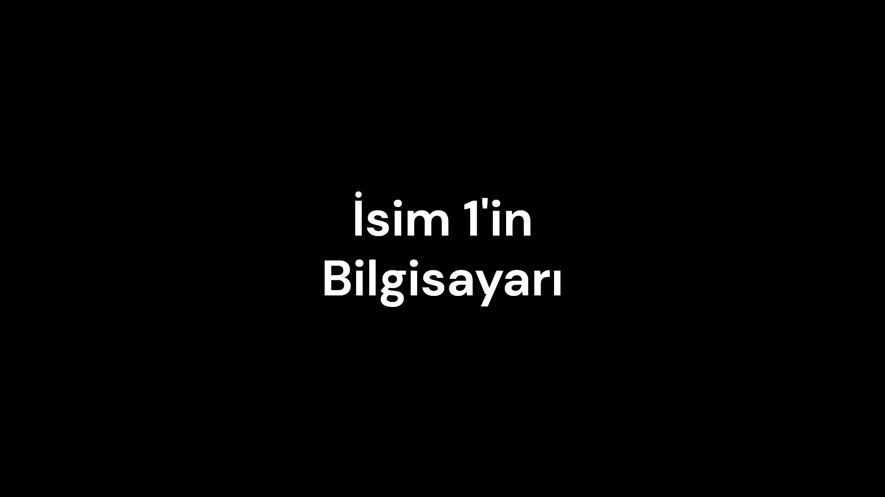
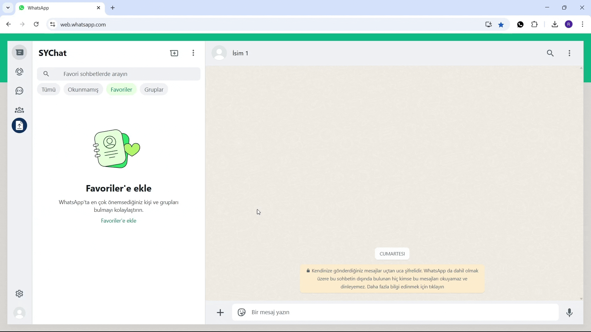
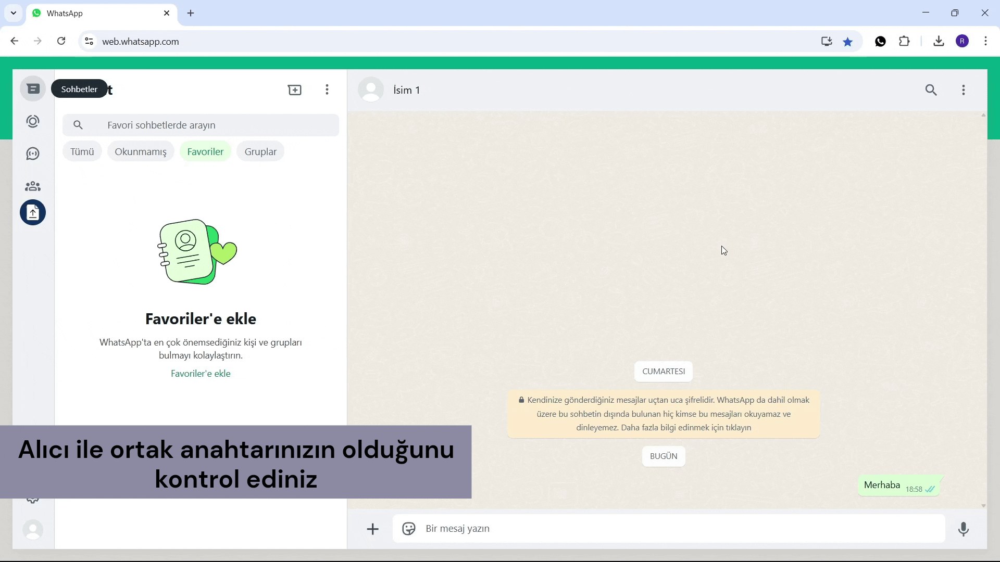

# SYChat
> Whatsapp Web için geliştirilmiş bu chrome eklentisi, yerleşik şifrelemenin yanı sıra AES algoritması ile ekstra güvenlik sağlayarak mesajlarınızı şifreler.

## Açıklama
Bu Chrome eklentisi, Whatsapp Web'teki mesajlar için ek bir güvenlik katmanı sağlar. Whatsapp Web'in yerleşik şifreleme özelliklerine ek olarak, mesajlarınızı AES (Advanced Encryption Standard) algoritması ile ekstra bir şifrelemeye tabi tutarak gizliliğinizi daha da artırır.

Sunduğu özellikler:
- Mesajları şifreleme / çözme
- Dosyaları şifreleme / çözme
- Sohbetin ortak anahtarını manuel belirleme
- Ortak anahtar belirlemek için Diffie-Hellman kullanma
- Anahtarları dosya olarak dışarı aktarma ve dosyayı içeri aktarma

https://github.com/user-attachments/assets/55979807-d6a3-412f-9cf0-d9f0a3e9688f

## İçindekiler
<ol>
	<li>
		<a href="#başlangıç">Başlangıç</a>
		<ul>
			<li><a href="#bağımlılıklar">Bağımlılıklar</a></li>
			<li><a href="#kurulum">Kurulum</a></li>
			<li><a href="#yapılandırma">Yapılandırma</a></li>
			<li><a href="#kullanım">Kullanım</a></li>
		</ul>
	</li>
	<li><a href="#lisans">Lisans</a></li>
	<li><a href="#Iletişim">İletişim</a></li>
</ol>

## Başlangıç
### Bağımlılıklar
Proje aşağıdaki tarayıcılarda test edilmiştir:
- **Google Chrome**
- **Microsoft Edge**

<p align="right">(<a href="#SYChat">back to top</a>)</p>

---

### Kurulum
1. Bu repository'yi kendi bilgisayarınıza klonlayın:
	```bash
	git clone https://github.com/seymenkonuk/SYChat.git
	```

2. Projeye gidin:
	```bash
	cd SYChat
	```

3. Gerekli yapılandırmaları yaptıktan sonra eklentiyi tarayıcınıza kurunuz.
	- Chrome için kurulum aşamaları:
		1. `chrome://extensions/` adresine gidiniz.
		2. **Geliştirici Modu** aktif ediniz.
		3. `build/` klasörünü tarayıcıya sürükleyiniz.

<p align="right">(<a href="#SYChat">back to top</a>)</p>

---

### Yapılandırma
1. Sohbetlerinizde kullanılan anahtarlar, tarayıcının depolamasında şifreli bir şekilde saklanır. Eklenti ayarlarından bu dosyayı dışarı aktarabilir veya içeri aktarabilirsiniz.  Şifreleme anahtarı `build/src/config.min.js` dosyasındaki key bilgisidir. Güvenliğiniz için bu değeri değiştirmelisiniz.
	```js
	export const key="yeni-key-bilgisi";
	```
2. Eklentinin ismini değiştirmek isterseniz:
	- `build/src/config.min.js` dosyasında app_name'i değiştiriniz.
		```js
		export const app_name="yeni-app-ismi";
		```
	- `build/manifest.json` dosyasında **name**'i değiştiriniz.

<p align="right">(<a href="#SYChat">back to top</a>)</p>

---

### Kullanım
- Manuel Anahtar Belirleme
	1. Bir anahtar belirleyin ya da rastgele oluşturun.
	2. Eklentinin pop-up menüsünden anahtarı giriniz.
	3. **Anahtarı karşı tarafa güvenli bir şekilde iletiniz.** (Ör: PGP ile)
	4. Karşı taraf da eklentinin pop-up menüsünden anahtarı girmelidir.

	

- Diffie-Hellman ile Ortak Anahtar Belirleme
	1. Karşı tarafa public anahtarınızı gönderiniz.
	2. Karşı tarafın kendi public anahtarını göndermesini bekleyiniz.
	3. İki tarafta kendi public anahtarını gönderdiğinde; **Diffie-Hellman** algoritması ile **güvenli** bir şekilde otomatik olarak ortak anahtar oluşturulur. 

	

- Şifreli Mesaj Gönderme
	1. Anahtarı belirleyiniz.
	2. Mesajı yazınız ve **CTRL+ENTER** ile gönderiniz.

	

- Şifreli Dosya Gönderme
	1. Anahtarı belirleyiniz.
	2. Dosyayı sol taraftaki **mavi** dosya yükleme alanına sürükleyiniz.

	

- Şifreli Dosyayı Çözme
	1. Anahtarı belirleyiniz.
	2. Şifreli dosyayı indiriniz.
	3. Şifreli dosyayı sol taraftaki **mavi** dosya yükleme alanına sürükleyiniz.
	4. Çözülmüş dosya bilgisayarınıza indirilecektir.
	
	

<p align="right">(<a href="#SYChat">back to top</a>)</p>

---

## Lisans
Bu proje [MIT Lisansı](https://github.com/seymenkonuk/SYChat/blob/main/LICENSE) ile lisanslanmıştır.

<p align="right">(<a href="#SYChat">back to top</a>)</p>

---

## Iletişim
Proje ile ilgili sorularınız veya önerileriniz için bana ulaşabilirsiniz:

GitHub: https://github.com/seymenkonuk

LinkedIn: https://www.linkedin.com/in/recep-seymen-konuk/

Proje Bağlantısı: [https://github.com/seymenkonuk/SYChat](https://github.com/seymenkonuk/SYChat)

<p align="right">(<a href="#SYChat">back to top</a>)</p>

---
